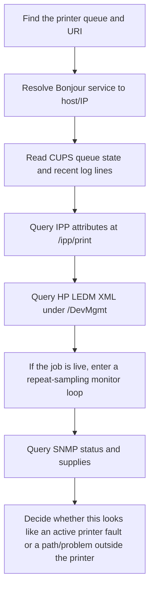
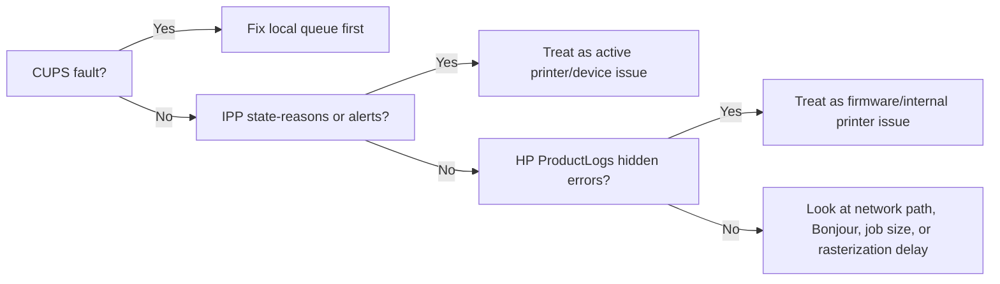
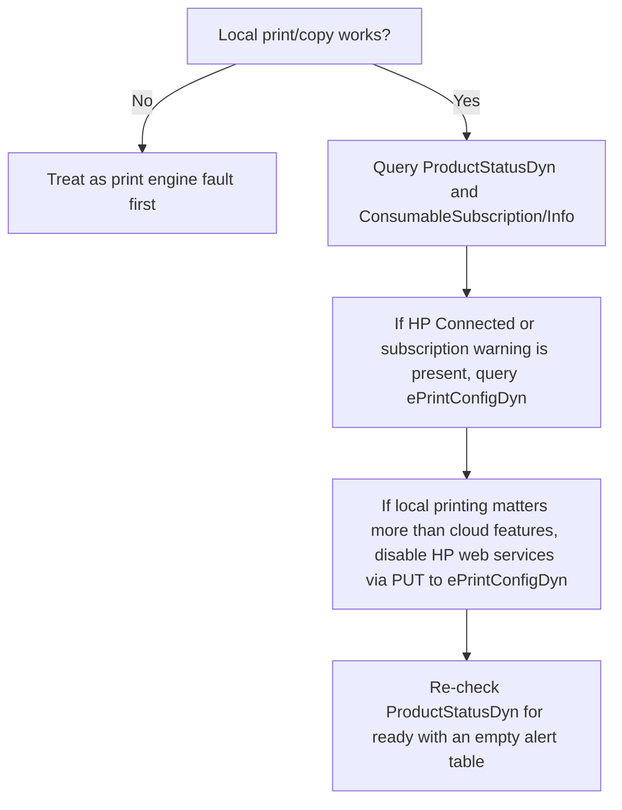

# Diagnostic Approach

This document explains the high-level workflow behind the diagnostic and repair tools. It is the operational reasoning for the tool, not a verbatim internal chain-of-thought dump.

## Goal

When a printer says it is "printing" for a long time, there are several distinct failure zones:

- The Mac or CUPS queue may be stalled.
- The printer may be reachable but rejecting or delaying jobs.
- HP-specific firmware logs may contain errors that CUPS never shows.
- SNMP may expose a hardware or supply condition that IPP does not.

The script moves through those layers in order so each later query answers a narrower question.

## Workflow

## Why This Order

### 1. CUPS first

`lpstat` and the recent CUPS log immediately tell us whether the local queue is paused, jammed, disabled, or holding onto failed jobs. If CUPS already shows a fault, there is no need to go deeper first.

### 2. IPP second

IPP is the standard protocol view of the printer. This is where `printer-state`, `printer-state-reasons`, `queued-job-count`, `printer-alert`, and marker levels live. If IPP reports `idle`, `accepting-jobs`, and `printer-state-reasons=none`, the printer is not advertising an obvious active fault.

### 3. HP LEDM XML third

HP's embedded web server exposes richer diagnostic data than standard IPP. The most important endpoint for hidden issues is `ProductLogsDyn.xml`, because it can reveal internal error codes that are absent from the front panel and from CUPS.

### 4. SNMP last

SNMP is useful for older printer-management fields, especially simple hardware status and supply telemetry. It is the least structured of the interfaces here, so it is better as a confirmation layer than as the starting point.

### 5. Monitor while the job is actually stuck

One-shot snapshots can miss the important transition. The script now has a monitor mode that samples the queue and printer repeatedly during printing so you can catch transient states such as:

- CUPS saying `now printing`
- IPP switching to `printer-state=processing`
- `printer-state-reasons` changing only while the printer is hung
- HP `/Jobs/JobList` showing a live `Processing` entry

## Decision Model

## HP Connected And Instant Ink Path

When the printer can produce local pages but the front panel is stuck on an HP Connected or Instant Ink message, the failure zone is different. That is not the same as a stuck print engine.

The repair script includes a guarded `--execute`/`--fix` path for the full repair recipe. When the printer is stuck on an HP Connected or Instant Ink panel state, the recipe may send writable fields to `/ePrint/ePrintConfigDyn.xml`:

- `EmailService=disabled`
- `SipService=disabled`
- `MobileAppsService=disabled`
- `RegistrationState=unregistered`
- `XMPPConnectionState=disconnected`
- `BeaconState=disabled`

That keeps the local printing path available while turning off HP web services on the printer.

## What A Healthy But Slow Printer Looks Like

In the healthy-but-slow case, the script usually shows some combination of:

- `printer-state=idle`
- `printer-state-reasons=none`
- `printer-is-accepting-jobs=true`
- `StatusCategory=ready`
- No current jobs in the queue

If those remain clean while the user still sees long "printing" times, the delay is more likely to be:

- AirPrint or Bonjour name resolution
- Wireless transport issues
- A job that takes a long time for the printer to rasterize
- A firmware problem only hinted at by HP's internal logs
