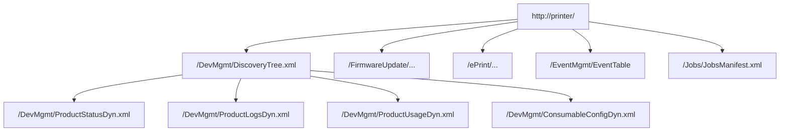
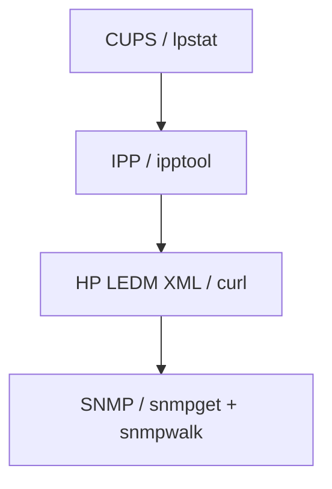

# HP LEDM Endpoints

HP printers often expose an embedded web server with XML endpoints under `/DevMgmt`. These are useful because they can surface information that standard CUPS and IPP do not.

## Endpoint Map



## Endpoints Queried By The Script

| Endpoint | Why it is queried | What it typically exposes |
| --- | --- | --- |
| `/DevMgmt/DiscoveryTree.xml` | Enumerate supported HP resources before assuming a capability exists. | Available `DevMgmt` resources and feature manifests. |
| `/DevMgmt/ProductStatusDyn.xml` | Read HP's current status view. | `StatusCategory`, status string IDs, and current alert table contents. |
| `/DevMgmt/ProductLogsDyn.xml` | Surface hidden internal errors and event codes. | Event codes, sequence numbers, and the embedded `ErrorLog` text block. |
| `/DevMgmt/ProductUsageDyn.xml` | Pull lifetime and operational counters. | Total impressions, duplex sheets, jam events, mispick events, wireless usage, and more. |
| `/DevMgmt/ConsumableConfigDyn.xml` | Inspect cartridge and consumable state. | Cartridge labels, percent remaining, measured state, and authenticity/subscription flags. |
| `/DevMgmt/ProductConfigDyn.xml` | Pull support identifiers and device settings. | Firmware revision/date, service ID, region, timestamp, and power-save settings. |
| `/FirmwareUpdate/FirmwareUpdateDyn.xml` | Inspect firmware update policy and class layout. | Automatic check/update flags and current firmware-update class state. |
| `/FirmwareUpdate/WebFWUpdate/State` | Read the current firmware update state. | Idle, active, or error status for the web firmware updater. |
| `/FirmwareUpdate/WebFWUpdate/Config` | Read firmware auto-check configuration. | Whether automatic firmware checks and updates are enabled. |
| `/ePrint/ePrintConfigDyn.xml` | Inspect HP cloud/web-services state. | Registration state, XMPP state, signaling state, and service toggles. |
| `/ePrint/ePrintConfigDyn.xml` via `PUT` | Disable HP web services when the panel is stuck on HP Connected / Instant Ink. | Writable fields only: cloud-service toggles, registration state, XMPP state, and beacon state. |
| `/ePrint/ClaimStatus` | Read the current ePrint claim workflow state. | Idle or active claim status. |
| `/ePrint/ConnectionStateReason` | Surface a specific cloud connection reason when available. | A vendor-specific reason string for connection problems. |
| `/ConsumableSubscription/Info` | Inspect Instant Ink / subscription status separately from ePrint. | `active`, `connectNowWarning`, last connection date, and page-extension state. |
| `/EventMgmt/EventTable` | Read the device-side event categories after resets or alerts. | Recent event categories and aging stamps. |
| `/Jobs/JobList` | Observe the live printer-side job list during a hang. | Job URL, category, state, and state update fields. |

## Exploration Endpoint

| Endpoint | Why it was explored |
| --- | --- |
| `/Jobs/JobsManifest.xml` | Confirm that the printer exposes an HP jobs namespace and understand what job resources exist before reading `/Jobs/JobList`. |

## Relationship To Other Layers



## Example Of Why `ProductLogsDyn.xml` Matters

The HP status endpoint can still say `ready` while `ProductLogsDyn.xml` contains internal firmware-style entries in the `ErrorLog` block. That makes it the most important HP-specific endpoint when the user sees unexplained slowness or jobs that appear to hang.

## Raw Query Examples

```bash
curl -s http://PRINTER_IP/DevMgmt/DiscoveryTree.xml
curl -s http://PRINTER_IP/DevMgmt/ProductStatusDyn.xml
curl -s http://PRINTER_IP/DevMgmt/ProductLogsDyn.xml
curl -s http://PRINTER_IP/DevMgmt/ProductUsageDyn.xml
curl -s http://PRINTER_IP/DevMgmt/ConsumableConfigDyn.xml
curl -s http://PRINTER_IP/ConsumableSubscription/Info
curl -s http://PRINTER_IP/ePrint/ePrintConfigDyn.xml
```
